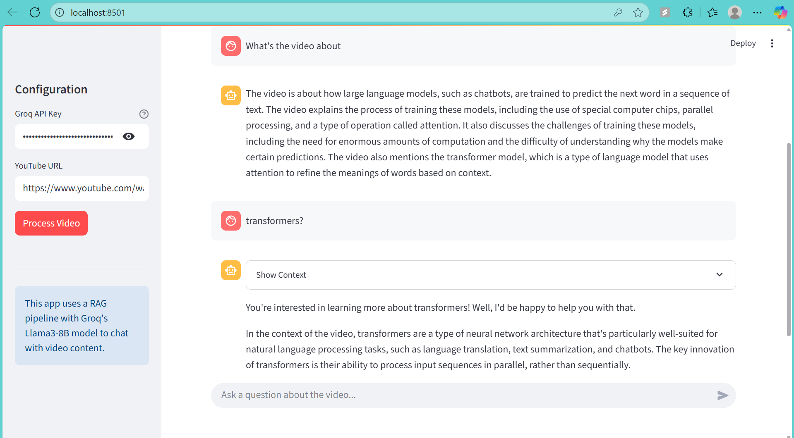

# Chat with any YouTube Video

An interactive AI-powered tool that lets you have a conversation with any YouTube video. Simply provide a video URL, and the application will process its content, allowing you to ask specific questions and get instant, context-aware answers.

This project leverages a **Retrieval-Augmented Generation (RAG)** pipeline to deliver accurate responses based solely on the video's transcript.



---

### Key Features

* **Interactive Chat:** Ask complex questions in natural language and receive answers synthesized directly from the video's content.
* **Semantic Search:** Goes beyond simple keyword matching to understand the *meaning* behind your query, finding the most relevant video segments.
* **On-the-Fly Processing:** Processes videos in real-time without needing a pre-existing database.
---

### System Architecture

This project uses a Retrieval-Augmented Generation (RAG) pipeline to provide answers:

1.  **Ingestion & Transcription:** A YouTube URL is provided. The audio is downloaded using `yt-dlp` and transcribed into text using OpenAI's `Whisper` model.
2.  **Chunking & Indexing:** The transcript is split into overlapping text chunks. Each chunk is converted into a vector embedding using a `Sentence-Transformer` model.
3.  **In-Memory Vector Store:** The text chunks and their corresponding vector embeddings are stored in a `FAISS` index, which lives in your computer's memory for the duration of the session.
4.  **Retrieval & Generation:** When a user asks a question, it's embedded into a vector. A similarity search is performed in the FAISS index to retrieve the most relevant text chunks. These chunks, along with the original question, are then passed to the Llama 3 8B model via the Groq API to generate a final answer.

---

### Tech Stack

* **Application Framework:** Streamlit
* **Audio Transcription:** `openai-whisper`
* **Language Model:** Llama 3 8B via `groq` API
* **Vector Search:** `faiss-cpu` & `sentence-transformers`
* **YouTube Downloader:** `yt-dlp`

---

### How to Run Locally

#### Prerequisites

* Python 3.8+
* [FFmpeg](https://ffmpeg.org/download.html) installed and accessible in your system's PATH.

#### Setup Instructions

1.  **Clone the repository:**
    ```bash
    git clone [https://github.com/your-username/YT-Chatbot.git](https://github.com/your-username/YT-Chatbot.git)
    cd YT-Chatbot
    ```

2.  **Create a virtual environment and install dependencies:**
    ```bash
    python -m venv venv
    source venv/bin/activate  # On Windows, use `venv\Scripts\activate`
    pip install streamlit openai-whisper yt-dlp sentence-transformers faiss-cpu groq
    ```

3.  **Run the Streamlit app:**
    ```bash
    streamlit run app.py
    ```

4.  Open your browser to `http://localhost:8501`, enter your Groq API key and a YouTube URL, and start chatting!
